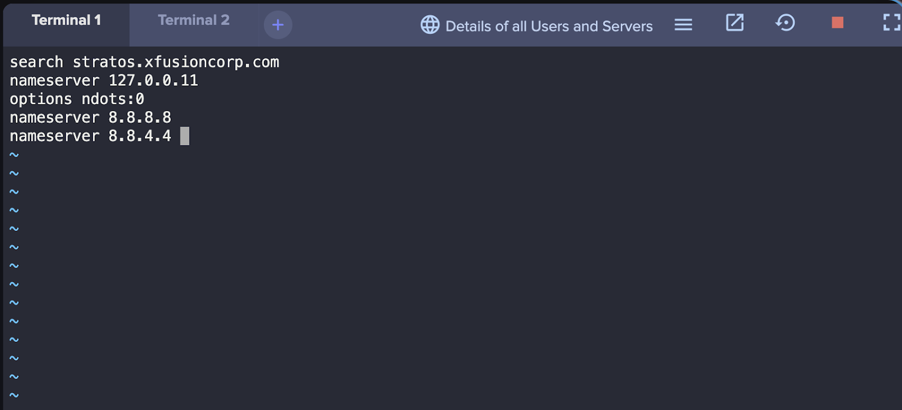
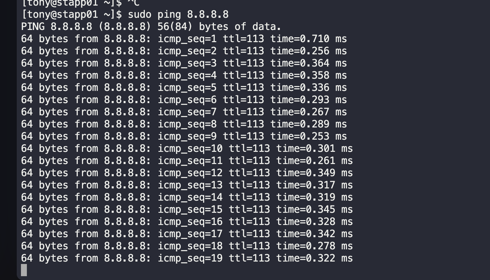

## Task Summary

The system admins team of xFusionCorp Industries noticed intermittent DNS resolution issues in several apps. App Server 1 in the Stratos Datacenter was specifically experiencing DNS resolution problems. To address this, additional DNS nameservers needed to be added to the server.

### Steps Taken

1. Opened the configuration file for the DNS resolver located at `/etc/resolv.conf`.

2. Added the following lines at the top of the file to configure Google public DNS nameservers:
   
   nameserver 8.8.8.8
   nameserver 8.8.4.4

   
3. Saved the changes and exited the file.
4. Restarted the DNS resolver service to apply the changes.
