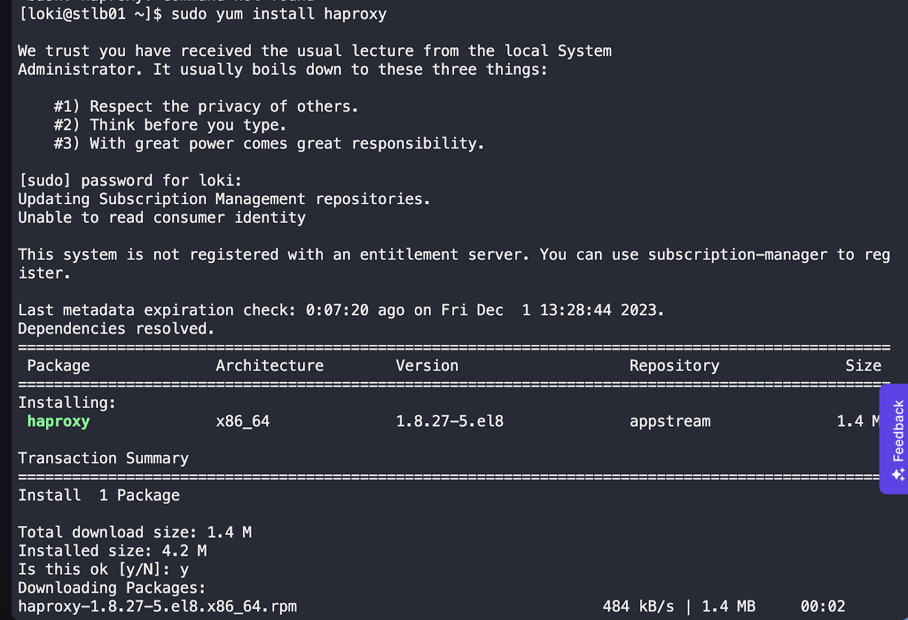
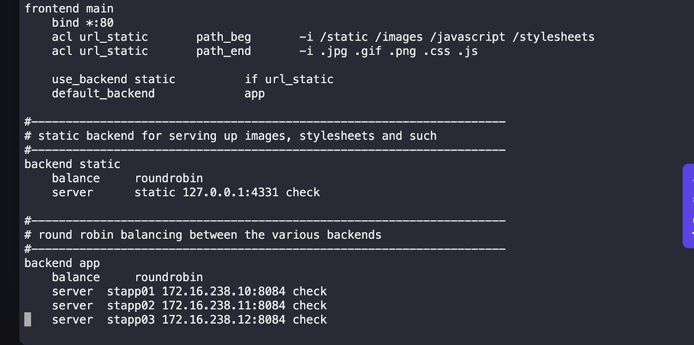
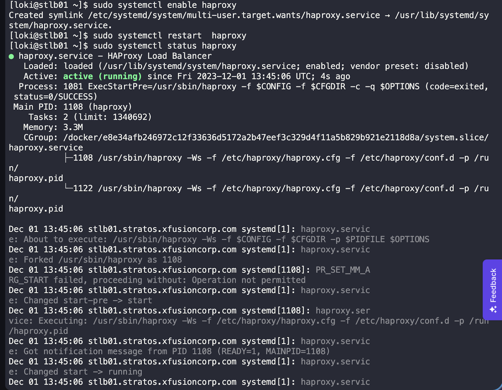

## Summary of the Task:

The task involves installing and configuring HAProxy on the LBR (Load Balancer) server using yum. The goal is to set up HAProxy to balance the load between multiple app servers running Apache on port 8084. Once the configuration is complete, the website can be accessed using the "StaticApp" button on the top bar.

### Steps to Install and Configure HAProxy:

1. SSH into the HAProxy server.
2. Install HAProxy using the command: `sudo yum install haproxy`.

3. Open the HAProxy configuration file: `sudo vi /etc/haproxy/haproxy.cfg`.
4. Add the following lines to the configuration file to set up load balancing:

```haproxy
frontend main
    bind *:80
    acl url_static       path_beg       -i /static /images /javascript /stylesheets
    acl url_static       path_end       -i .jpg .gif .png .css .js

    use_backend static          if url_static
    default_backend             app

backend app
    balance     roundrobin
    server  stapp01 172.16.238.10:8084 check
    server  stapp02 172.16.238.11:8084 check
    server  stapp03 172.16.238.12:8084 check
```


5.	Validate the file to see if there are any errors: haproxy -c -f /etc/haproxy/haproxy.cfg.
6.	Enable HAProxy: sudo systemctl enable haproxy.

7.	Restart HAProxy: sudo systemctl restart haproxy.

8.	Confirm if the site is reachable using curl and checking it in a browser.


