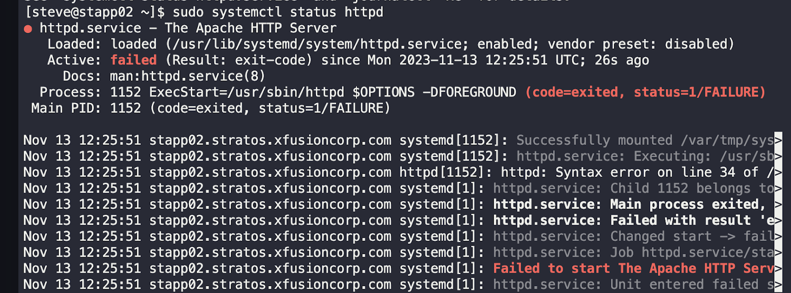
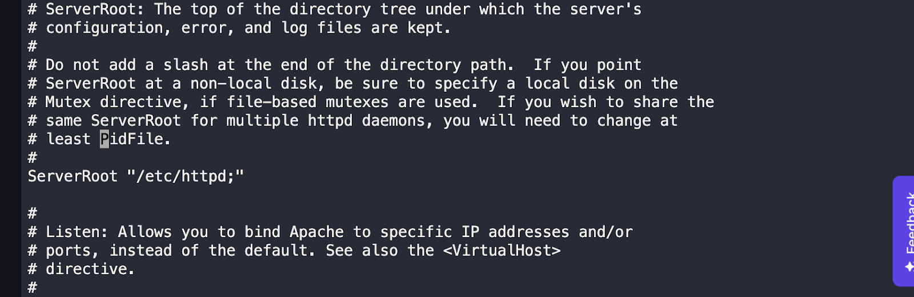
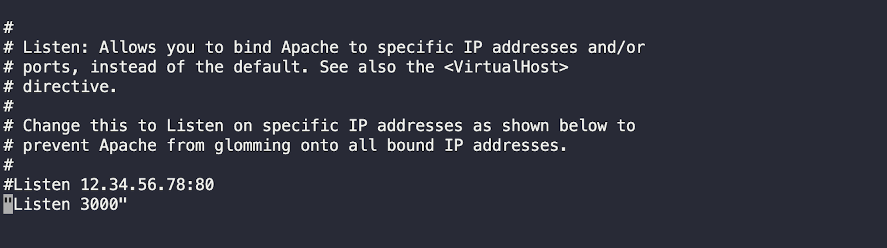
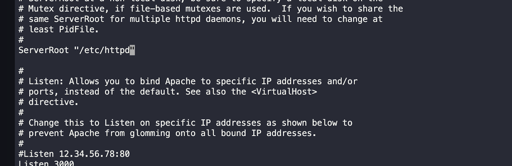
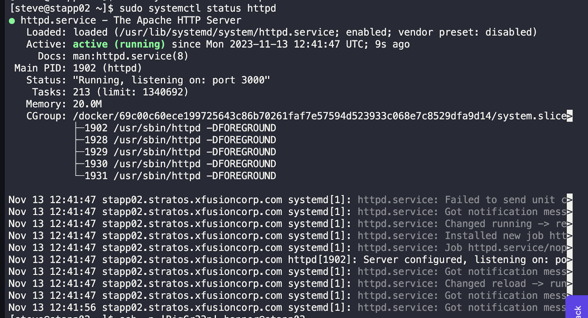

## Task Summary

The task involved troubleshooting the Apache service on the Nautilus Application Servers in the Stratos Datacenter. The monitoring system identified that Apache was not running on some servers. 

### Steps Taken

1. Checked the server's reachability by using the curl command.

2. Enabled and started the httpd service, which was not starting initially.

3. Discovered a syntax problem in the /etc/httpd/conf/httpd.conf file and made the necessary corrections under the "listen" and "documentroot" sections.

4. After making the changes, the httpd service was able to start and the servers became reachable.

