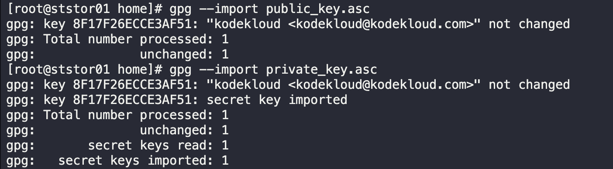
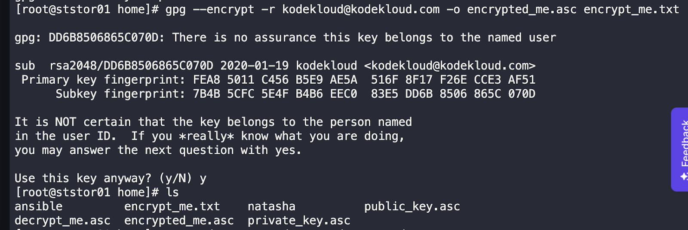
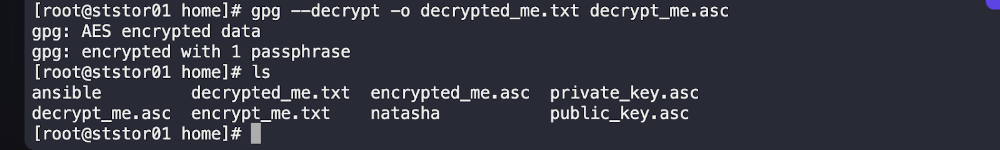

Linux GPG ENCRYPTION
*Task:*

We have confidential data that needs to be transferred to a remote location and ensure its security. To achieve this, we need to perform encryption and decryption using GPG (GNU Privacy Guard).

Perform the following actions using the provided keys and passphrase:

1. Encryption:
   - Encrypt the file `/home/encrypt_me.txt` to `/home/encrypted_me.asc`.
   - Use the private and public keys stored at `/home/*_key.asc`.
   - Passphrase for encryption: `kodekloud`.

2. Decryption:
   - Decrypt the file `/home/decrypt_me.asc` to `/home/decrypted_me.txt`.
   - Use the private and public keys stored at `/home/*_key.asc`.
   - Passphrase for decryption: `kodekloud`.

User ID: `kodekloud@kodekloud.com`

Please ensure that the file paths and passphrase are correctly used in your solution.

*Solution:*

1. Import Keys:
   bash
   gpg --import public_key.asc
   gpg --import private_key.asc (use the passphrase given for the private key)

2. Encryption:
   bash
   gpg --encrypt -r kodekloud@kodekloud.com -o encrypted_me.asc /home/encrypt_me.txt
   
   Passphrase: `kodekloud`

3. Decryption:
   bash
   gpg --decrypt --o decrypted_me.txt /home/decrypt_me.asc
   
   Passphrase: `kodekloud`

