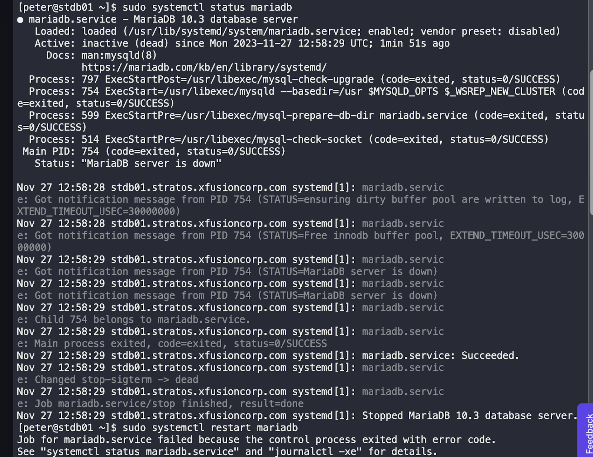
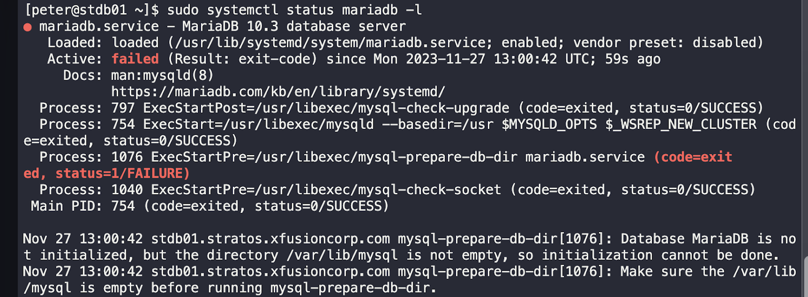
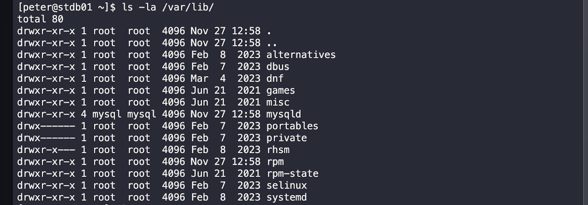
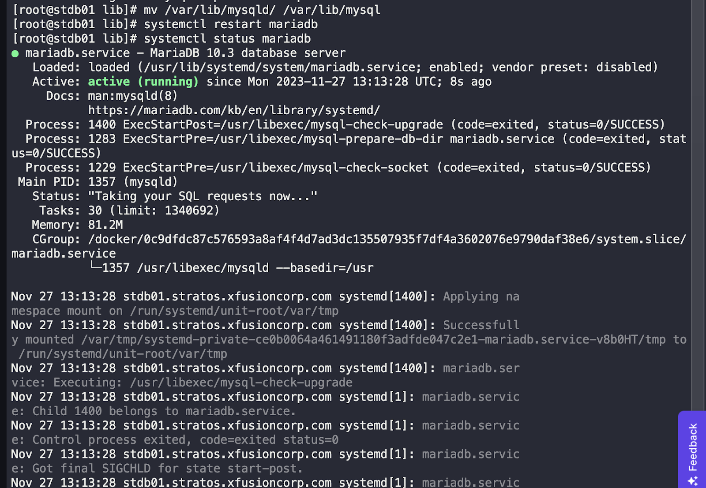

*Task:*
There is a critical issue going on with the Nautilus application in Stratos DC. The production support team identified that the application is unable to connect to the database. After digging into the issue, the team found that mariadb service is down on the database server.

*Solution:*
To resolve the issue, i used these steps:
1. I checked the status of mariadb using the command: `sudo systemctl status mariadb`.

2. I used the sudo systemctl status mariadb -l to display all logs to find the error, Noticed the error message stating that the database directory was not empty and initialization couldn't be done.

3. I observed that the directory /var/lib only contains "mysqld" instead of "mysql".

4. I moved the contents of /var/lib/mysqld/ to /var/lib/mysql using the command: `mv /var/lib/mysqld/ /var/lib/mysql`.
5. I restart mariadb using sudo systemctl restart mariadb.
6. Verify that the mariadb service starts successfully and the Nautilus application can connect to the database.

This solution successfully resolves the issue, and the Nautilus application is now functioning as expected.
