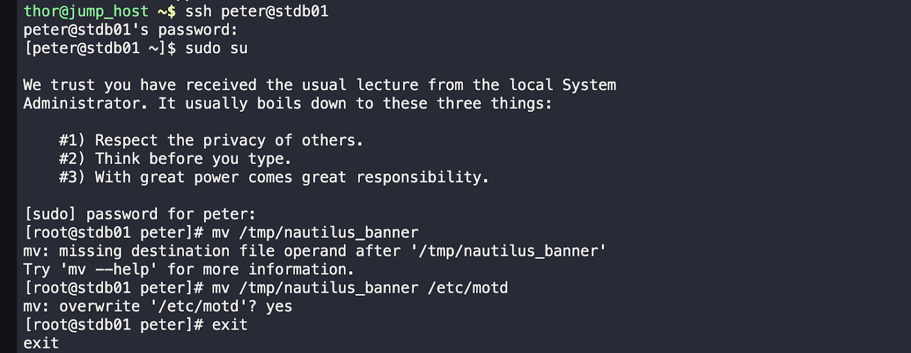

*Task:*
 Update the message of the day on all application and db servers for Nautilus using an approved template located at `/home/thor/nautilus_banner` on the jump host.

*Solution:*
1. Navigate to the location of the approved template: `cd /home/thor/nautilus_banner`.
2. I copied the template file to each application server and database server using SCP: `scp -r /home/thor/nautilus_banner peter@stdb01:/tmp`.
3. Went to the destination path in each server /tmp.
4. I moved the template file to the appropriate name for the message of the day file (motd): `mv /tmp/nautilus_banner /etc/motd`.
5. I verified that the message of the day has been updated by logging out and logging back in to each server.

